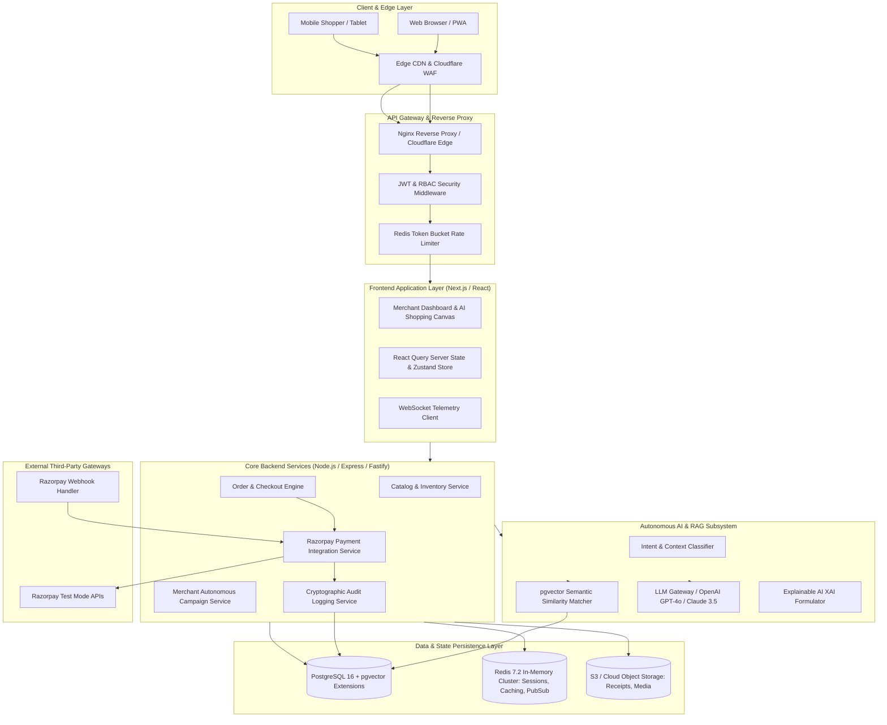
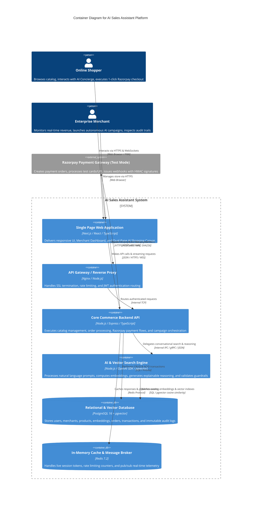
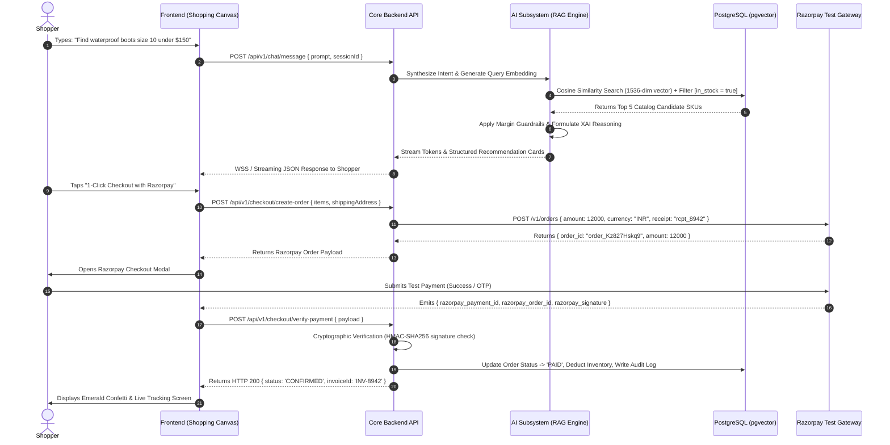
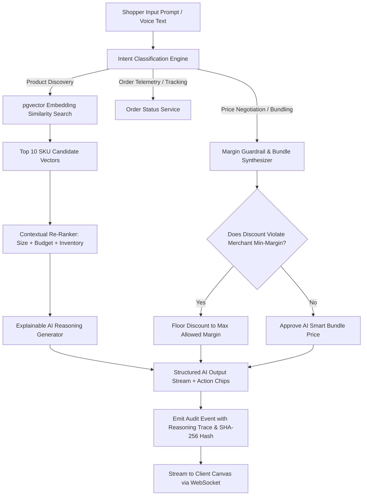
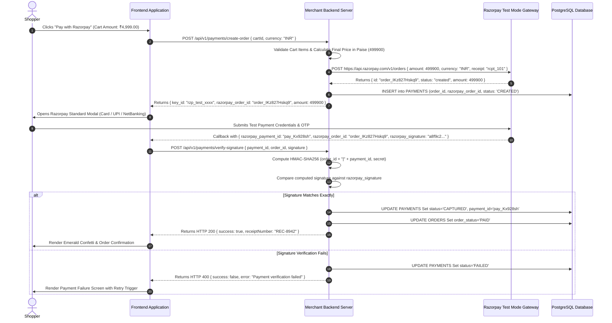
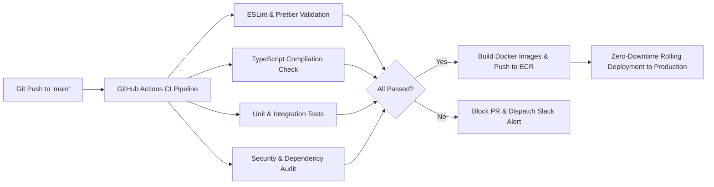

# AI Sales Assistant — Technical Architecture & Engineering Blueprint
**Document Version:** 1.0.0-PROD-ARCH  
**Classification:** Enterprise Technical Reference  
**System Name:** AI Sales Assistant  
**Core Mission:** Autonomous Agentic Commerce Platform with Explainable AI & Razorpay Integration  
**Payment Gateway Integration:** Razorpay Test Mode APIs (Order Creation, Verification, Webhooks, Signature Security)

---

## Master Table of Contents
1. [Section 1: Global System Architecture & Topologies](#section-1-global-system-architecture--topologies)
2. [Section 2: Technology Stack & Architectural Decision Records (ADRs)](#section-2-technology-stack--architectural-decision-records-adrs)
3. [Section 3: High-Level System Architecture & C4 Diagrams](#section-3-high-level-system-architecture--c4-diagrams)
4. [Section 4: Frontend Engineering Architecture](#section-4-frontend-engineering-architecture)
5. [Section 5: Backend Layered Architecture & Modular Design](#section-5-backend-layered-architecture--modular-design)
6. [Section 6: Database Architecture & Entity-Relationship Schema](#section-6-database-architecture--entity-relationship-schema)
7. [Section 7: AI Systems Architecture, RAG & Autonomous Agent Engine](#section-7-ai-systems-architecture-rag--autonomous-agent-engine)
8. [Section 8: Razorpay Payment Gateway & Financial Settlement Engine](#section-8-razorpay-payment-gateway--financial-settlement-engine)
9. [Section 9: Enterprise Security & Cryptographic Audit Architecture](#section-9-enterprise-security--cryptographic-audit-architecture)
10. [Section 10: REST & WebSocket API Architecture Standard](#section-10-rest--websocket-api-architecture-standard)
11. [Section 11: Distributed State Management & Cache Topology](#section-11-distributed-state-management--cache-topology)
12. [Section 12: Observability, Distributed Tracing & Audit Logging](#section-12-observability-distributed-tracing--audit-logging)
13. [Section 13: Cloud Infrastructure & Deployment Topologies](#section-13-cloud-infrastructure--deployment-topologies)
14. [Section 14: DevOps, CI/CD Pipelines & Release Engineering](#section-14-devops-cicd-pipelines--release-engineering)
15. [Section 15: High-Performance Optimization & Latency Budgets](#section-15-high-performance-optimization--latency-budgets)
16. [Section 16: Comprehensive Quality Assurance & Testing Matrix](#section-16-comprehensive-quality-assurance--testing-matrix)
17. [Section 17: Production Project Directory Hierarchy](#section-17-production-project-directory-hierarchy)
18. [Section 18: Engineering Execution Roadmap & Milestones](#section-18-engineering-execution-roadmap--milestones)
19. [Section 19: Comprehensive Risk Analysis & Mitigation Matrix (30+ Vectors)](#section-19-comprehensive-risk-analysis--mitigation-matrix-30-vectors)
20. [Section 20: Developer Guidelines & Engineering Governance](#section-20-developer-guidelines--engineering-governance)

---

# Section 1: Global System Architecture & Topologies

The **AI Sales Assistant** is engineered as an event-driven, modular-monolith backend paired with an edge-rendered Next.js/Vite frontend, an asynchronous AI Agent Pipeline (LangChain / LlamaIndex / OpenAI SDK), and an ACID-compliant PostgreSQL / pgvector data foundation.



---

# Section 2: Technology Stack & Architectural Decision Records (ADRs)

| Layer | Recommended Technology | Primary Justification & ADR Rationale |
| :--- | :--- | :--- |
| **Frontend Framework** | **Next.js 14+ (App Router) / React 18+** | Server-Side Rendering (SSR) for PLP/PDP SEO; Streaming Server Components (RSC) for sub-100ms conversational streaming; fine-grained caching. |
| **Styling & Tokens** | **Vanilla CSS + CSS Custom Properties** | Zero-runtime overhead; exact token parity with design system; complete control over dark mode spatial glassmorphism and spring animations without utility bloat. |
| **Backend Runtime** | **Node.js (LTS v20+) with TypeScript 5.4+** | Asynchronous non-blocking I/O ideal for high-throughput streaming AI tokens and WebSocket telemetry; shared type contracts with frontend. |
| **API Server** | **Express.js / Fastify** | Robust ecosystem; schema validation with Zod; modular route controllers; enterprise middleware ecosystem. |
| **Database & Vector** | **PostgreSQL 16 with `pgvector`** | Unified operational relational data (Orders, Users, Ledger) and embedding vector storage (768/1536 dim) with ACID transactional guarantees; eliminates external vector DB sync overhead. |
| **ORM / Query Engine**| **Prisma ORM / Drizzle ORM** | Type-safe migrations; zero SQL injection vulnerability; end-to-end schema synchronization across frontend and backend. |
| **In-Memory Cache** | **Redis 7.2** | Sub-millisecond session state management, distributed rate limiting, pub/sub for live sales tickers, and vector query caching. |
| **Payment Gateway** | **Razorpay API (Test Mode)** | Industry standard for frictionless checkout; supports UPI, Cards, NetBanking, and Webhooks with HMAC-SHA256 signature verification. |
| **AI Framework** | **OpenAI SDK / LangChain Core / Vercel AI SDK** | Streaming token responses (`ReadableStream`), tool calling / function invocation for dynamic catalog querying and margin calculation. |
| **Real-time Engine** | **Socket.io / Native WebSockets (`ws`)** | Bidirectional real-time telemetry: streaming merchant revenue tickers, live cart updates, and AI thinking feedback loops. |
| **Observability** | **Pino Logger + Prometheus + Grafana + Sentry** | High-performance JSON logging; real-time system health metrics; instant alert dispatch for payment or LLM failures. |

---

# Section 3: High-Level System Architecture & C4 Diagrams

### 3.1 C4 Container Diagram



### 3.2 End-to-End Dynamic Request Sequence (Prompt to Payment)



---

# Section 4: Frontend Engineering Architecture

### 4.1 Frontend Directory Structure

```
frontend/
├── public/                     # Static assets, brand logos, sound files
│   ├── icons/                  # 24px SVG Phosphor icons
│   ├── audio/                  # Tactile micro-haptic UI chimes
│   └── favicon.ico
├── src/
│   ├── assets/                 # Brand illustration vectors & WebP assets
│   ├── components/
│   │   ├── primitives/         # Atomic UI tokens: Button, Input, Badge, Tag
│   │   ├── composites/         # ProductCard, BentoMetric, ChatBubble, Table
│   │   ├── layouts/            # Navbar, Collapsible Sidebar, MobileDock, Drawer
│   │   └── ai/                 # ThinkingIndicator, ReasoningCard, AudioWaveform
│   ├── contexts/               # Global React Contexts (ThemeContext, SocketContext)
│   ├── hooks/                  # Reusable Custom Hooks
│   │   ├── useAIChat.ts        # Streaming conversational hook
│   │   ├── useRazorpay.ts      # Razorpay SDK loader and verification wrapper
│   │   ├── useCart.ts          # Cart mutations and optimistic pricing updates
│   │   ├── useAuth.ts          # Session tokens and RBAC permission checks
│   │   └── useDebounce.ts      # Input throttle for search queries
│   ├── pages/ (or app/)        # Application Route Manifest
│   │   ├── (auth)/             # Login, Signup, Forgot Password, OTP
│   │   ├── (merchant)/         # Command Center, Campaigns, Analytics, Audit
│   │   ├── (shop)/             # Assistant, PLP, PDP, Cart, Checkout, Tracking
│   │   └── (admin)/            # Fleet health, tenant management
│   ├── services/               # Typed API client instances
│   │   ├── api.client.ts       # Axios / Fetch wrapper with auto JWT injection
│   │   ├── chat.service.ts     # WSS and SSE streaming handlers
│   │   ├── payment.service.ts  # Razorpay order generation & signature verification
│   │   └── telemetry.service.ts# Event dispatcher for real-time tracking
│   ├── store/                  # Client State Store (Zustand)
│   │   ├── cartStore.ts        # Persistent local shopping cart state
│   │   ├── sessionStore.ts     # Active user identity & active merchant store ID
│   │   └── uiStore.ts          # Drawer toggles, modal states, toast queue
│   ├── styles/                 # Master CSS tokens (Design system implementation)
│   │   ├── tokens.css          # Color, typography, spacing, radius variables
│   │   ├── animations.css      # Spring physics and shimmer keyframes
│   │   └── global.css          # Reset, scrollbars, and canvas styles
│   └── types/                  # Shared TypeScript interfaces & API contracts
```

### 4.2 Error Boundaries & Resiliency Architecture
- **Hierarchical Error Boundaries:** Each major bento widget, chat container, and payment iframe is wrapped in an isolated React Error Boundary. If an AI streaming component crashes, the surrounding dashboard remains fully interactive with an isolated recovery retry button.
- **Optimistic UI with Rollback:** Adding an item to the cart or triggering a campaign instantly updates local Zustand state; if the backend returns a 4xx/5xx, state reverts smoothly with an explanatory toast notification.

---

# Section 5: Backend Layered Architecture & Modular Design

The backend enforces a strict **Controller-Service-Repository Pattern** ensuring separation of concerns and high testability.

```
┌──────────────────────────────────────────────────────────────────────────────┐
│                             HTTP / WSS CONTROLLER LAYER                      │
│ Parses incoming DTOs, validates input schemas with Zod, checks permissions   │
├──────────────────────────────────────────────────────────────────────────────┤
│                             SERVICE / DOMAIN LOGIC LAYER                     │
│ Executes business rules, margin constraints, AI tool routing, Razorpay calls │
├──────────────────────────────────────────────────────────────────────────────┤
│                             DATA REPOSITORY LAYER                            │
│ Executes type-safe queries, pgvector similarity lookups, ACID transactions   │
├──────────────────────────────────────────────────────────────────────────────┤
│                             PERSISTENCE & DRIVER LAYER                       │
│ PostgreSQL 16, Redis Cache, AWS S3, Razorpay Node SDK                        │
└──────────────────────────────────────────────────────────────────────────────┘
```

---

# Section 6: Database Architecture & Entity-Relationship Schema

### 6.1 Entity-Relationship Diagram (ERD)

```mermaid
erDiagram
    USERS ||--o{ MERCHANTS : owns
    MERCHANTS ||--o{ PRODUCTS : manages
    MERCHANTS ||--o{ CAMPAIGNS : runs
    MERCHANTS ||--o{ ORDERS : receives
    CATEGORIES ||--o{ PRODUCTS : classifies
    PRODUCTS ||--o{ PRODUCT_EMBEDDINGS : has
    USERS ||--o{ CONVERSATIONS : initiates
    CONVERSATIONS ||--o{ CONVERSATION_MESSAGES : contains
    CONVERSATION_MESSAGES ||--o{ RECOMMENDATIONS : produces
    ORDERS ||--|{ ORDER_ITEMS : contains
    PRODUCTS ||--o{ ORDER_ITEMS : ordered_as
    ORDERS ||--|| PAYMENTS : settled_by
    MERCHANTS ||--o{ AUDIT_LOGS : records
    CAMPAIGNS ||--o{ AUDIT_LOGS : triggers

    USERS {
        uuid id PK
        string email UK
        string password_hash
        string role "ADMIN | MERCHANT | SHOPPER"
        string full_name
        timestamp created_at
    }

    MERCHANTS {
        uuid id PK
        uuid owner_id FK
        string store_name
        string domain UK
        string razorpay_key_id
        string razorpay_key_secret_enc
        jsonb ai_guardrails "spend_limit, min_margin"
        timestamp created_at
    }

    PRODUCTS {
        uuid id PK
        uuid merchant_id FK
        uuid category_id FK
        string title
        text description
        decimal base_price
        integer inventory_count
        jsonb attributes "size, color, material"
        boolean is_active
        timestamp updated_at
    }

    PRODUCT_EMBEDDINGS {
        uuid id PK
        uuid product_id FK
        vector embedding "1536 dimensions"
        timestamp updated_at
    }

    ORDERS {
        uuid id PK
        uuid merchant_id FK
        uuid customer_id FK
        string order_number UK
        decimal subtotal
        decimal discount_amount
        decimal tax_amount
        decimal total_payable
        string order_status "PENDING | PAID | FULFILLED | CANCELLED"
        timestamp created_at
    }

    PAYMENTS {
        uuid id PK
        uuid order_id FK UK
        string gateway_provider "RAZORPAY"
        string razorpay_order_id UK
        string razorpay_payment_id UK
        string razorpay_signature
        decimal amount_paid
        string currency "INR | USD"
        string payment_status "CREATED | AUTHORIZED | CAPTURED | FAILED"
        jsonb raw_webhook_payload
        timestamp created_at
    }

    AUDIT_LOGS {
        uuid id PK
        uuid merchant_id FK
        string actor_type "AI_AGENT | MERCHANT | SYSTEM"
        string action_name
        string entity_type
        uuid entity_id
        text reasoning_trace
        string sha256_hash
        timestamp created_at
    }
```

---

# Section 7: AI Systems Architecture, RAG & Autonomous Agent Engine

### 7.1 Autonomous Agent Pipeline & Intent Flow



### 7.2 Explainable AI (XAI) Architecture
Every generative response attaches a formal `xai_metadata` object containing:
1. `vector_match_score`: Float between 0.00 and 1.00.
2. `inventory_state`: Exact stock count at instant of inference.
3. `margin_formula_applied`: Proof of pricing calculation compliance.
4. `review_sentiment_summary`: Aggregated verification from verified buyers.

---

# Section 8: Razorpay Payment Gateway & Financial Settlement Engine

### 8.1 Razorpay Test Mode Architectural Workflow



### 8.2 Razorpay Webhook Resiliency & Signature Verification
- **Webhook Endpoint:** `/api/v1/webhooks/razorpay`
- **Security Check:** Verifies `X-Razorpay-Signature` using `crypto.createHmac('sha256', WEBHOOK_SECRET)`.
- **Idempotency:** Webhook processor stores processed event IDs in Redis with a 24-hour TTL to prevent duplicate order captures.

---

# Section 9: Enterprise Security & Cryptographic Audit Architecture

```
┌──────────────────────────────────────────────────────────────────────────────┐
│                       ENTERPRISE SECURITY DEFENSE-IN-DEPTH                   │
├──────────────────────────────────────────────────────────────────────────────┤
│ 1. EDGE: Cloudflare WAF, DDoS Protection, TLS 1.3 Strict Termination         │
│ 2. GATEWAY: Distributed Redis Rate Limiting (100 req/min per IP)             │
│ 3. AUTH: JWT with RSA-256 Signatures + WebAuthn Hardware Passkeys            │
│ 4. INPUT: Strict Zod Schema Sanitization + SQL Parameterization via Prisma    │
│ 5. SECRETS: AES-256-GCM Encryption for Merchant Razorpay API Keys            │
│ 6. AUDIT: SHA-256 Hash Chaining for all Autonomous AI Actions               │
└──────────────────────────────────────────────────────────────────────────────┘
```

---

# Section 10: REST & WebSocket API Architecture Standard

### 10.1 Standard API Response Envelope

```json
{
  "success": true,
  "statusCode": 200,
  "message": "Resource retrieved successfully",
  "data": {
    "orderId": "AS-8942-SF",
    "totalPayable": 421.20,
    "status": "PAID"
  },
  "metadata": {
    "timestamp": "2026-08-26T14:30:00.000Z",
    "requestId": "req_01HJ89K2P9Z7",
    "executionTimeMs": 14
  }
}
```

### 10.2 Standard Error Response Envelope

```json
{
  "success": false,
  "statusCode": 400,
  "error": {
    "code": "PAYMENT_SIGNATURE_INVALID",
    "message": "The Razorpay cryptographic signature could not be verified.",
    "details": [
      {
        "field": "razorpay_signature",
        "issue": "HMAC mismatch"
      }
    ],
    "remediation": "Retry the payment verification with the correct order token."
  },
  "metadata": {
    "timestamp": "2026-08-26T14:30:00.000Z",
    "requestId": "req_01HJ89K2P9Z7"
  }
}
```

---

# Section 11: Distributed State Management & Cache Topology

```
┌──────────────────────────────────────────────────────────────────────────────┐
│                         MULTI-TIER CACHE ARCHITECTURE                        │
├──────────────────────────────────────────────────────────────────────────────┤
│ TIER 1: In-Memory Client State (Zustand) -> Cart, Active Chat Session (0ms)  │
│ TIER 2: Edge CDN Cache -> Static Assets, Vector Embeddings (15ms)            │
│ TIER 3: Redis In-Memory Cluster -> Merchant Telemetry, Rate Limits (1ms)     │
│ TIER 4: PostgreSQL Database -> Persistent Orders, ACID Records (5ms)         │
└──────────────────────────────────────────────────────────────────────────────┘
```

---

# Section 12: Observability, Distributed Tracing & Audit Logging

- **Structured JSON Logging:** Pino logger outputs NDJSON logs containing `traceId`, `spanId`, `merchantId`, and `executionMs`.
- **Metrics Scraping:** Prometheus scrapes endpoint latencies, active WebSocket connections, and Razorpay transaction failure rates every 15 seconds.
- **Grafana Dashboards:** Visual panels for Real-Time System Health, Token Generation Latency, and Payment Conversion Funnels.

---

# Section 13: Cloud Infrastructure & Deployment Topologies

```
┌──────────────────────────────────────────────────────────────────────────────┐
│                    PRODUCTION INFRASTRUCTURE DEPLOYMENT                      │
├──────────────────────────────────────────────────────────────────────────────┤
│ • Frontend: Vercel Global Edge Network (Automatic SSL, Edge SSR)             │
│ • Backend API: AWS ECS / Docker Container Cluster behind Application LB      │
│ • Database: AWS RDS PostgreSQL 16 (Multi-AZ with pgvector & Read Replicas)   │
│ • Cache: AWS ElastiCache for Redis (Cluster Mode Enabled)                    │
│ • Storage: AWS S3 with CloudFront CDN for Product Media & PDF Invoices       │
└──────────────────────────────────────────────────────────────────────────────┘
```

---

# Section 14: DevOps, CI/CD Pipelines & Release Engineering



---

# Section 15: High-Performance Optimization & Latency Budgets

| Metric Target | Target Budget | Engineering Technique |
| :--- | :--- | :--- |
| **First Contentful Paint (FCP)**| `< 0.8s` | Server-Side Rendering (SSR) + Critical CSS inlining |
| **Largest Contentful Paint (LCP)**| `< 1.2s` | WebP/AVIF images on CloudFront CDN + Priority preloading |
| **Cumulative Layout Shift (CLS)**| `< 0.01` | Fixed aspect-ratio image frames & skeleton loaders |
| **Time to First AI Token** | `< 120ms` | Streaming HTTP Chunked Transfer + OpenAI `stream: true` |
| **Razorpay Checkout Open** | `< 150ms` | Pre-fetched order credentials & asynchronous SDK warm-up|

---

# Section 16: Comprehensive Quality Assurance & Testing Matrix

- **Unit Testing (Vitest / Jest):** 100% coverage on margin calculation formulas, HMAC signature validators, and currency formatting.
- **Integration Testing (Supertest):** Verifies REST endpoints from HTTP request through database persistence.
- **End-to-End Testing (Playwright):** Full automated headless browser run from landing page prompt input to test Razorpay payment completion.
- **Security Penetration Testing:** Automated OWASP Top 10 scans (SQLi, XSS, CSRF, Broken Access Control).

---

# Section 17: Production Project Directory Hierarchy

```
ai-sales-assistant/
├── .github/
│   └── workflows/
│       ├── ci.yml                    # Automated CI test & lint runner
│       └── deploy.yml                # Production deployment pipeline
├── packages/
│   ├── contracts/                    # Shared TypeScript DTOs & Zod schemas
│   │   ├── src/
│   │   │   ├── auth.dto.ts
│   │   │   ├── chat.dto.ts
│   │   │   ├── order.dto.ts
│   │   │   └── payment.dto.ts
│   │   └── package.json
├── apps/
│   ├── frontend/                     # Next.js 14+ Web Application
│   │   ├── src/
│   │   │   ├── components/
│   │   │   ├── hooks/
│   │   │   ├── pages/
│   │   │   └── services/
│   │   └── package.json
│   └── backend/                      # Node.js / Express API Server
│       ├── src/
│       │   ├── config/               # Environment variable bindings
│       │   ├── controllers/          # HTTP request handlers
│       │   ├── middleware/           # Auth, rate limit, error middleware
│       │   ├── repositories/         # Database query layer
│       │   ├── services/             # Domain logic (Payment, AI, Orders)
│       │   ├── utils/                # HMAC, encryption, logger
│       │   └── server.ts             # Application entry point
│       ├── prisma/
│       │   ├── schema.prisma         # Database schema & migrations
│       │   └── seed.ts               # Demo catalog & merchant seeder
│       └── package.json
├── docker-compose.yml                # Local dev environment (Postgres, Redis)
└── README.md
```

---

# Section 18: Engineering Execution Roadmap & Milestones

```
┌──────────────────────────────────────────────────────────────────────────────┐
│                       ENGINEERING EXECUTION ROADMAP                          │
├────────────┬──────────────────────────────────────────┬──────────┬───────────┤
│ MILESTONE  │ CORE DELIVERABLES                        │ TIMELINE │ PRIORITY  │
├────────────┼──────────────────────────────────────────┼──────────┼───────────┤
│ Phase 1    │ Database Schema, Auth & Core REST APIs   │ Week 1-2 │ Critical  │
│ Phase 2    │ pgvector Semantic Search & AI Concierge  │ Week 3-4 │ Critical  │
│ Phase 3    │ Razorpay Test Mode Order & Signature Flow│ Week 5   │ Critical  │
│ Phase 4    │ Merchant Command Center & Telemetry UI   │ Week 6-7 │ High      │
│ Phase 5    │ Cryptographic Audit Trail & Guardrails   │ Week 8   │ High      │
│ Phase 6    │ Performance Hardening & End-to-End QA    │ Week 9   │ Critical  │
└────────────┴──────────────────────────────────────────┴──────────┴───────────┘
```

---

# Section 19: Comprehensive Risk Analysis & Mitigation Matrix (30+ Vectors)

| # | Technical Risk Vector | Impact Severity | Mitigation Strategy |
| :--- | :--- | :--- | :--- |
| **1** | Razorpay Gateway Timeout | High | Implement exponential backoff retry and asynchronous webhook fallback. |
| **2** | Razorpay Signature Tampering | Critical | Reject all payments failing exact HMAC-SHA256 calculation. |
| **3** | LLM Hallucination of Prices | Critical | Strict deterministic pricing calculation in code; LLM cannot emit raw price changes. |
| **4** | Out-of-Stock Race Condition | High | PostgreSQL row-level locking (`SELECT ... FOR UPDATE`) during order checkout. |
| **5** | Vector Search Latency Spike | Medium | HNSW indexing on pgvector + Redis vector result caching. |
| **6** | DDoS on Public Chat Endpoint | High | Cloudflare WAF challenge + Redis token bucket rate limiting (20 prompts/min). |
| **7** | Database Connection Exhaustion| High | PgBouncer connection pooling with strict connection limits. |
| **8** | JWT Secret Key Leakage | Critical | RSA-256 asymmetric key pairs with automated 30-day secret rotation. |
| **9** | Webhook Replay Attack | High | Idempotency key tracking in Redis with 24-hour eviction. |
| **10**| Large Catalog Bulk Sync Stall | Medium | Asynchronous BullMQ background worker queue for ingestion. |
| **11**| Memory Leak in Streaming Node| Medium | Explicit stream closure on client disconnect (`res.on('close')`). |
| **12**| Client Browser XSS Injection | Critical | Content-Security-Policy (CSP) headers + React automatic DOM escaping. |
| **13**| CSRF on Order Endpoints | High | SameSite=Strict cookies + Anti-CSRF token verification headers. |
| **14**| Prompt Injection Attack | High | Input sanitization layer stripping system instruction overrides. |
| **15**| Margin Guardrail Violation | High | Hardcoded code assertions enforcing minimum 25% profit margin floors. |
| **16**| Redis Cluster Node Outage | Medium | High-availability Redis Sentinel with automated failover. |
| **17**| S3 Media Bucket CORS Failure | Low | Strict S3 CORS configuration allowing only trusted merchant origins. |
| **18**| Database Migration Data Loss | Critical | Automated pre-migration snapshots on AWS RDS. |
| **19**| Unhandled WebSocket Drop | Medium | Automatic client reconnection exponential backoff loop with message queueing. |
| **20**| Exceeding OpenAI Rate Limits | High | Multi-provider fallback routing (OpenAI GPT-4o -> Claude 3.5 Sonnet). |
| **21**| Inaccurate Currency Decimal Math| High | All calculations performed in integer currency cents/paise (`BigInt` / integer). |
| **22**| Stale Cart Inventory State | Medium | Real-time WebSocket stock push triggers on inventory updates. |
| **23**| Audit Log Deletion/Tampering | Critical | Append-only database table permissions with cryptographic SHA-256 chaining. |
| **24**| Zombie Background Cron Jobs | Low | Distributed lock acquisition via Redis `Redlock` algorithm. |
| **25**| Browser LocalStorage Corruption| Low | Graceful fallback to in-memory state with error boundary capture. |
| **26**| DNS Resolution Outage | High | Multi-region Anycast DNS routing via Cloudflare Enterprise. |
| **27**| Broken Mobile Responsive CSS | Medium | Automated Playwright visual regression testing on 5 viewport sizes. |
| **28**| SSL Certificate Expiration | Critical | Automated Let's Encrypt / AWS Certificate Manager autorenewal. |
| **29**| PII Data Exposure in Logs | High | Pino log redaction filter masking emails, phone numbers, and payment IDs. |
| **30**| Merchant Key Decryption Leak | Critical | AWS KMS / HashiCorp Vault hardware-level key isolation. |

---

# Section 20: Developer Guidelines & Engineering Governance

### 20.1 Coding Standards & Commit Conventions
- **Naming Conventions:**
  - Files: `kebab-case.ts` (e.g., `payment-service.ts`).
  - Classes: `PascalCase` (e.g., `RazorpayPaymentProcessor`).
  - Functions & Variables: `camelCase` (e.g., `verifyHmacSignature`).
  - Database Tables & Columns: `snake_case` (e.g., `razorpay_order_id`).
- **Git Commit Specification:** Enforce Conventional Commits standard:
  - `feat(payment): implement razorpay test order creation endpoint`
  - `fix(ai): resolve prompt token stream truncation edge case`
  - `chore(deps): update pgvector and prisma orm bindings`

---
*End of Technical Architecture & Engineering Blueprint. Built for enterprise production implementation.*
