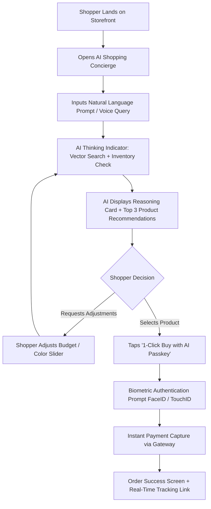
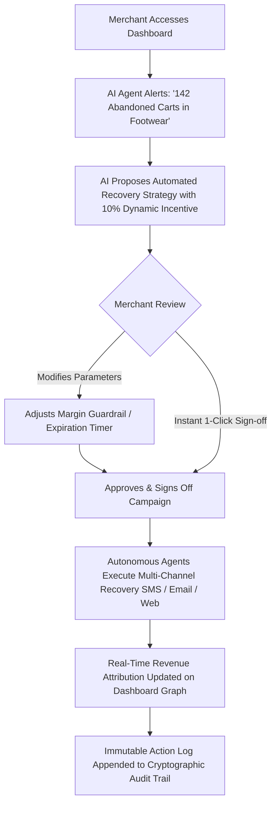
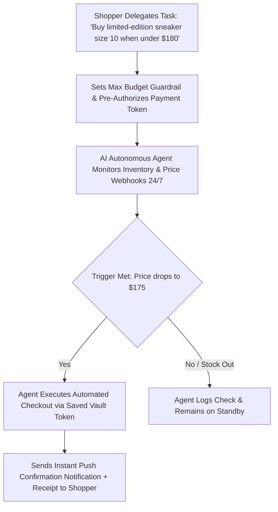

# AI Sales Assistant — Comprehensive UI/UX Design Specification
**Version:** 1.0.0-PROD  
**Author:** Senior Product Design & Design System Architecture Team  
**Product:** AI Sales Assistant  
**Tagline:** *The AI-powered commerce platform that helps merchants increase revenue while enabling AI-first shopping experiences.*  
**Target Platforms:** Responsive Web (Desktop, Laptop, Tablet, Mobile) & Progressive Web App (PWA)

---

## Table of Contents
1. [Section 1: Design Vision & Principles](#section-1-design-vision--principles)
2. [Section 2: Brand Identity & Visual Language](#section-2-brand-identity--visual-language)
3. [Section 3: Complete Color System & Semantic Tokens](#section-3-complete-color-system--semantic-tokens)
4. [Section 4: Typography System & Hierarchy](#section-4-typography-system--hierarchy)
5. [Section 5: Spacing, Grid & Layout System](#section-5-spacing-grid--layout-system)
6. [Section 6: Design Tokens (Elevation, Radius, Motion, Z-Index)](#section-6-design-tokens)
7. [Section 7: Universal Component Library (30+ Components)](#section-7-universal-component-library)
8. [Section 8: Desktop Screen Specifications (34 Screens)](#section-8-desktop-screen-specifications)
9. [Section 9: Mobile Screen & Touch Experience](#section-9-mobile-screen--touch-experience)
10. [Section 10: Complete User Journeys & Interaction Flows](#section-10-complete-user-journeys--interaction-flows)
11. [Section 11: AI Experience & Agentic Interaction Design](#section-11-ai-experience--agentic-interaction-design)
12. [Section 12: Motion Design & Micro-Interactions](#section-12-motion-design--micro-interactions)
13. [Section 13: Responsive Breakpoint Matrix](#section-13-responsive-breakpoint-matrix)
14. [Section 14: UX Writing & Content Strategy Guide](#section-14-ux-writing--content-strategy-guide)
15. [Section 15: Accessibility (WCAG 2.2 AAA) Specification](#section-15-accessibility-specification)
16. [Section 16: Comprehensive Design QA Checklist](#section-16-comprehensive-design-qa-checklist)
17. [Section 17: Frontend Developer Handoff & Implementation Blueprint](#section-17-frontend-developer-handoff)

---

# Section 1: Design Vision & Principles

### 1.1 Overall Design Philosophy
The **AI Sales Assistant** design philosophy fuses **Linear’s precision & craft**, **Apple’s spatial minimalism & material depth**, **Stripe’s data clarity & financial trustworthiness**, and **Vercel/OpenAI’s cutting-edge dark-mode futuristic intelligence**. 

The interface disappears to highlight two critical pillars:
1. **For Merchants:** Absolute control, real-time revenue visibility, high-throughput autonomous marketing orchestration, and granular AI safety telemetry.
2. **For Shoppers / AI Buyers:** Frictionless discovery, ambient conversational commerce, instant zero-latency checkout, and hyper-personalized reasoning transparency.

```
       ┌─────────────────────────────────────────────────────────────┐
       │                   DESIGN PHILOSOPHY TRIAD                   │
       ├──────────────────────────────┬──────────────────────────────┤
       │     PRECISION TELEMETRY      │     AMBIENT CONVERGENCE      │
       │ (Stripe/Linear Craft & Data) │ (Conversational AI + Canvas) │
       ├──────────────────────────────┴──────────────────────────────┤
       │                  ZERO-FRICTION AUTONOMY                     │
       │        (Sub-second Checkout, Transparent Agent Trust)       │
       └─────────────────────────────────────────────────────────────┘
```

### 1.2 Visual Style: "Luminous Precision"
- **Surface Depth:** Multi-tiered obsidian dark mode (`#0B0D13` base) paired with a crisp, high-contrast daylight mode (`#F8FAFC`). Subtly blurred backdrop glass surfaces (Frosted Glassmorphism: `backdrop-filter: blur(16px)` with 1px border specular highlights `rgba(255,255,255,0.08)`).
- **Luminescence:** Subtle, ambient radial glow gradients (`Violet/Electric Indigo` and `Cyan/Teal Nebula`) indicating active AI intelligence without distracting from content readability.
- **Micro-borders:** 1px hairline structural borders (`rgba(255,255,255,0.08)` on dark, `rgba(15,23,42,0.08)` on light) provide crisp spatial segmentation.
- **Dimensionality:** Soft multi-point ambient occlusion shadows rather than harsh drop shadows.

### 1.3 Brand Personality
- **Intelligent & Foresighted:** Anticipates user intent before explicit input.
- **Sovereign & Trustworthy:** Bank-grade financial compliance, cryptographic audit trails, zero dark patterns.
- **Effortless & Minimal:** Complex autonomous machine-learning logic condensed into 1-click tactile actions.
- **Dynamic & Responsive:** Surfaces react fluidly to conversational cues, voice input, and high-frequency sales events.

### 1.4 Core Design Principles
1. **AI as an Amplification, Not an Obstruction:** The conversational AI assistant sits seamlessly alongside tabular and visual catalog interfaces, never locking the user into a rigid single-thread chatbot jail.
2. **Explainable by Default (XAI):** Every recommendation, dynamic pricing tweak, and autonomous campaign action displays an inspectable "Why this was suggested" reasoning badge.
3. **Sub-100ms Perceived Latency:** Optimistic UI updates, skeleton states with shimmer gradients, and streaming token typography ensure no jarring stalls.
4. **Information Density with Breathing Room:** High-density merchant telemetry balanced by generous 8pt grid margins and modular bento-box card arrangements.
5. **Contextual Continuity:** Switching from mobile chat to desktop analytics preserves active sessions, cart state, reasoning history, and filter constraints seamlessly.

### 1.5 Accessibility Principles
- **WCAG 2.2 Level AAA Target** for core commerce pathways (Cart, Checkout, Payment, AI Dialogues).
- **High Contrast Assurance:** Minimum 7:1 contrast ratio for all standard body copy; minimum 4.5:1 for active interactive accents.
- **No Reliance on Color Alone:** Every status (Active, Warning, Critical Error, Success) pairs color with dedicated icons, descriptive text, and ARIA live regions.
- **Universal Keyboard Traversal:** 100% interactive elements navigable via standard sequential `Tab`/`Shift+Tab`, `Space`, `Enter`, and Esc dismissals. Focus rings utilize high-visibility double-layer outlines.

### 1.6 Responsive Principles
- **Fluid Hybrid Layouts:** Flexbox and CSS Grid foundations that adapt dynamically between 320px mobile screens and 3840px ultrawide merchant control centers.
- **Thumb-Zone Optimization (Mobile):** Primary conversion triggers, conversational inputs, and checkout drawers anchored in the lower 40% of the viewport.
- **Progressive Disclosure:** Expandable bento grids on desktop collapse into intuitive, vertically stacked swipeable card carousels on mobile devices.

### 1.7 AI-First Experience Principles
- **Streaming State Transparency:** Differentiate between *Searching Catalog*, *Synthesizing User Profile*, *Checking Real-Time Inventory*, and *Finalizing Recommendation*.
- **Direct Manipulation of AI Output:** Users can edit recommendation parameters (e.g., adjust budget sliders, toggle brand preferences) directly on the generated AI cards.
- **Guardrailed Delegation:** Clear visual boundaries distinguishing merchant-approved autonomous actions from suggestions requiring human sign-off.

---

# Section 2: Brand Identity & Visual Language

### 2.1 Brand Story
In an era where digital commerce is overwhelmed by infinite choice and fragmented inventory, merchants struggle to retain buyers while shoppers experience decision fatigue. **AI Sales Assistant** bridges this divide by deploying autonomous, empathic, and hyper-intelligent commerce agents. For merchants, it acts as an always-on Chief Revenue Officer and Sales Director. For shoppers, it is a personal shopping concierge that understands nuance, budget, sizing, and aesthetic preferences in real time.

### 2.2 Brand Voice & Tone Matrix

| Dimension | Our Voice | What It Means in Practice | What We Avoid |
| :--- | :--- | :--- | :--- |
| **Formality** | Professional & Crisp | Direct, concise, structured data, active voice. | Overly casual slang, robotic jargon, bureaucratic fluff. |
| **Enthusiasm** | Calibrated & Calm | Confident reassurance, understated celebration of wins. | Fake excitement, excessive exclamation marks (!!!), hype. |
| **AI Personality**| Empathetic & Objective| Transparent reasoning, respectful suggestions, humble honesty.| Claiming sentience, hallucinated confidence, sycophancy. |
| **Error Handling**| Accountable & Solution-Driven| Clear plain-language cause + 1-click immediate remediation.| Cryptic error codes, shifting blame to the user. |

### 2.3 Logo Concept & Construction
- **Symbol:** **"The Luminous Prism" (Nexus Orb)** — An isometric geometric monogram combining a stylized lowercase letter `a`, a diamond facet representing commerce value, and a radiant converging core symbolizing AI neural synthesis.
- **Grid Ratio:** 1:1.618 (Golden Section). Built upon an 8px circular matrix with continuous tangent curvature.
- **Clear Space:** Minimum clear space surrounding the mark equals 50% of the icon's total height (`X = 0.5H`).
- **Minimum Size:** 16px × 16px (Favicon/Status Bar), 24px × 24px (Mobile Header), 48px × 48px (Hero App Bar).

```
   ┌─────────────────────────────────────────────────────────────┐
   │                     LOGO CLEAR SPACE SPEC                   │
   │                                                             │
   │     ┌─────────────────────────────────────────────────┐     │
   │     │                     0.5H                        │     │
   │     │      ┌───────────────────────────────────┐      │     │
   │     │ 0.5H │   [ ◆ NEXUS PRISM ]  AI Sales     │ 0.5H │     │
   │     │      └───────────────────────────────────┘      │     │
   │     │                     0.5H                        │     │
   │     └─────────────────────────────────────────────────┘     │
   └─────────────────────────────────────────────────────────────┘
```

### 2.4 Logo Variations & Usage Rules
- **Primary Lockup:** Luminous Prism Symbol (Left) + Wordmark "AI Sales Assistant" in Outfit SemiBold (Right).
- **Monochrome Version:** Solid White (`#FFFFFF`) on dark surfaces; Solid Carbon (`#0F172A`) on light surfaces.
- **App Icon:** Nexus Prism floating on an obsidian gradient slate with a 1px specular inner glow.
- **Prohibited Usage:** Never rotate the mark, never stretch/distort proportions, never apply unapproved drop shadows, never place on low-contrast patterned backgrounds.

### 2.5 Iconography Style: "Phosphor Crisp"
- **Grid:** Built strictly on a 24px × 24px bounding box with a 20px live area and 2px padding.
- **Stroke Weight:** 1.5px uniform optical stroke width with subtle rounded endcaps (`stroke-linecap: round`, `stroke-linejoin: round`).
- **Visual Style:** Dual-tone iconography in active states (Primary 100% opacity stroke + 15% opacity tint fill).
- **Library Base:** Custom tailored icon set compatible with Lucide/Phosphor architecture.

### 2.6 Illustration & Generative Imagery Style
- **Abstract Data Landscapes:** 3D ray-traced geometric glass ribbons, translucent frosted prisms, and glowing vector topological meshes.
- **Color Temperature:** Deep deep violet (`#0F0B1E`) fading to electric cyan (`#06B6D4`) with emerald (`#10B981`) energy arcs.
- **No Cliché Robots:** Strict ban on generic 3D white robots, mechanical hands touching human hands, or glowing blue brain vectors. All illustrations depict structured data synthesis, revenue trajectory vectors, and spatial product arrays.

### 2.7 Photography & Product Render Guidelines
- **Lighting:** Studio rim-lit cinematic key lighting with neutral 5600K color balance.
- **Backgrounds:** Clean studio slate, matte dark granite, or seamless warm neutral cycloramas.
- **Depth of Field:** Soft optical blur on non-essential backgrounds (`f/2.8` equivalent depth) to keep product geometry sharp and primary.

---

# Section 3: Complete Color System & Semantic Tokens

The color architecture is built on a 3-layer token system: **Base Palette (Primitives)** → **Semantic Intent Tokens** → **Component-Level Design Tokens**.

### 3.1 Primary & Accent Color Palette

```
  Primary Indigo      Electric Violet      Cyan Nebula         Emerald Apex
   [ #4F46E5 ]          [ #7C3AED ]        [ #06B6D4 ]          [ #10B981 ]
  Core Brand/CTA      AI Intelligence     Telemetry/Live       Revenue Growth
```

| Token Name | Primitive HEX | RGB | HSL | Semantic Role & Usage | WCAG On Dark | WCAG On Light |
| :--- | :--- | :--- | :--- | :--- | :--- | :--- |
| `primary-50` | `#EEF2FF` | `238, 242, 255` | `226°, 100%, 97%` | Tint backgrounds, active list hovers (Light) | 18.2:1 | 1.1:1 |
| `primary-100` | `#E0E7FF` | `224, 231, 255` | `226°, 100%, 94%` | Light mode badge fills, selection rings | 16.4:1 | 1.3:1 |
| `primary-200` | `#C7D2FE` | `199, 210, 254` | `228°, 96%, 89%` | Focus rings, border accents | 13.8:1 | 1.6:1 |
| `primary-300` | `#A5B4FC` | `165, 180, 252` | `230°, 92%, 82%` | Secondary interactive highlights | 10.4:1 | 2.1:1 |
| `primary-400` | `#818CF8` | `129, 140, 248` | `234°, 89%, 74%` | Dark mode primary text links & icons | 7.6:1 (AAA)| 2.9:1 |
| `primary-500` | `#6366F1` | `99, 102, 241` | `239°, 84%, 67%` | Core Interactive Brand Color (Hover State) | 5.8:1 (AA) | 3.8:1 |
| `primary-600` | `#4F46E5` | `79, 70, 229` | `243°, 75%, 59%` | **Primary Brand Color / Main CTA Trigger** | 4.6:1 (AA) | 5.1:1 (AA) |
| `primary-700` | `#4338CA` | `67, 56, 202` | `245°, 58%, 51%` | Primary Button Active / Pressed State | 3.5:1 | 6.8:1 (AAA)|
| `primary-800` | `#3730A3` | `55, 48, 163` | `244°, 55%, 41%` | Dark mode panel borders, high-contrast pills | 2.4:1 | 9.4:1 (AAA)|
| `primary-900` | `#312E81` | `49, 46, 129` | `242°, 47%, 34%` | Deep accent container backgrounds | 1.8:1 | 12.1:1 (AAA)|
| `primary-950` | `#1E1B4B` | `30, 27, 75` | `244°, 47%, 20%` | Ambient radial glow base (Dark Mode) | 1.2:1 | 16.5:1 (AAA)|

### 3.2 AI & Futuristic Accent Palette

| Token Name | HEX | RGB | Purpose & Application |
| :--- | :--- | :--- | :--- |
| `ai-violet-500` | `#8B5CF6` | `139, 92, 246` | AI Autonomous Agent Triggers, Thinking Indicators |
| `ai-violet-400` | `#A78BFA` | `167, 139, 250` | AI Streaming Text Glow, Reasoning Badges |
| `ai-cyan-500` | `#06B6D4` | `6, 182, 212` | Live Inventory Sync, Telemetry Nodes, Real-time Webhooks |
| `ai-cyan-400` | `#22D3EE` | `34, 211, 238` | Live Audio Waveform indicators, Voice Concierge active pulse |
| `ai-fuchsia-500` | `#D946EF` | `217, 70, 239` | Conversion Spike alerts, Hyper-growth campaign triggers |

### 3.3 Functional / Feedback Semantic Palette

```
  Success (Emerald)    Warning (Amber)      Error (Rose)        Info (Sky)
     [ #10B981 ]         [ #F59E0B ]        [ #F43F5E ]         [ #0EA5E9 ]
   Revenue / Orders     Inventory Low       Failed Gateway      Sync / Details
```

| State | Base HEX | Surface Fill (10% Alpha) | Border Tone (20% Alpha) | Text & Icon Color (AAA Dark) |
| :--- | :--- | :--- | :--- | :--- |
| **Success** | `#10B981` | `rgba(16, 185, 129, 0.10)` | `rgba(16, 185, 129, 0.25)` | `#34D399` (Dark) / `#047857` (Light) |
| **Warning** | `#F59E0B` | `rgba(245, 158, 11, 0.10)` | `rgba(245, 158, 11, 0.25)` | `#FBBF24` (Dark) / `#B45309` (Light) |
| **Error** | `#F43F5E` | `rgba(244, 63, 94, 0.10)` | `rgba(244, 63, 94, 0.25)` | `#FB7185` (Dark) / `#BE123C` (Light) |
| **Info** | `#0EA5E9` | `rgba(14, 165, 233, 0.10)` | `rgba(14, 165, 233, 0.25)` | `#38BDF8` (Dark) / `#0369A1` (Light) |

### 3.4 Neutral & Surface System (Dual Mode Architecture)

| Token Name | Dark Mode Value | Light Mode Value | Application Description |
| :--- | :--- | :--- | :--- |
| `surface-canvas` | `#08090D` (Obsidian Deep) | `#F8FAFC` (Pure Slate) | Deepest underlying application viewport canvas |
| `surface-raised` | `#0F1117` (Obsidian Base) | `#FFFFFF` (Solid White) | Main page content background, dashboard base |
| `surface-card` | `#161922` (Card Slate) | `#FFFFFF` (Elevated White) | Default bento cards, table rows, modal backings |
| `surface-overlay` | `#1E2230` (Elevated Pop) | `#FFFFFF` (Shadow Cast) | Floating dropdown menus, tooltips, popovers |
| `surface-glass` | `rgba(22, 25, 34, 0.75)` | `rgba(255, 255, 255, 0.85)`| Sticky navigation headers, dock bars (`blur: 16px`) |
| `border-subtle` | `rgba(255, 255, 255, 0.06)`| `rgba(15, 23, 42, 0.06)` | Table dividers, horizontal rules |
| `border-standard`| `rgba(255, 255, 255, 0.12)`| `rgba(15, 23, 42, 0.12)` | Standard card borders, form input outlines |
| `border-strong` | `rgba(255, 255, 255, 0.20)`| `rgba(15, 23, 42, 0.22)` | Active tab indicators, hovered container outlines |
| `text-primary` | `#F8FAFC` (Slate 50) | `#0F172A` (Slate 900) | Primary headlines, hero numbers, critical copy |
| `text-secondary` | `#94A3B8` (Slate 400) | `#475569` (Slate 600) | Body paragraphs, supporting metadata, label titles |
| `text-muted` | `#64748B` (Slate 500) | `#94A3B8` (Slate 400) | Disabled elements, timestamp footnotes, watermarks |

### 3.5 Signature Gradients & Specular Glows
- **AI Neural Shimmer:** `linear-gradient(135deg, #4F46E5 0%, #7C3AED 50%, #06B6D4 100%)`
- **Merchant Revenue Wave:** `linear-gradient(180deg, rgba(16, 185, 129, 0.25) 0%, rgba(16, 185, 129, 0.00) 100%)`
- **Glass Specular Border:** `linear-gradient(135deg, rgba(255,255,255,0.18) 0%, rgba(255,255,255,0.02) 100%)`
- **Dark Hero Mesh Background:** `radial-gradient(circle at 50% -20%, rgba(79, 70, 229, 0.15), transparent 70%), radial-gradient(circle at 80% 20%, rgba(6, 182, 212, 0.08), transparent 50%), #08090D`

---

# Section 4: Typography System & Hierarchy

The typography architecture uses **Outfit** for modern, tech-forward Display/Headings, **Inter** for ultra-legible, crisp UI Body/Controls, and **JetBrains Mono** for financial telemetry, audit hashes, API keys, and code.

```
       ┌─────────────────────────────────────────────────────────────┐
       │                   TYPOGRAPHIC COMPOSITION                   │
       ├─────────────────────────────────────────────────────────────┤
       │  DISPLAY & HEADINGS : Outfit (Geometric, Humanist, Bold)    │
       │  BODY & UI CONTROLS : Inter (Engineered for Screens, Tall x)│
       │  DATA, CODE & CRYPTO: JetBrains Mono (Tabular, Monospaced)  │
       └─────────────────────────────────────────────────────────────┘
```

### 4.1 Type Scale Specification Table

| Level / Token | Desktop Size | Mobile Size | Line Height | Tracking | Weight | Target Font |
| :--- | :--- | :--- | :--- | :--- | :--- | :--- |
| `display-2xl` | 72px (4.5rem) | 44px (2.75rem)| 1.05 (76px)| -0.035em | 700 Bold | Outfit |
| `display-xl` | 56px (3.5rem) | 36px (2.25rem)| 1.10 (62px)| -0.030em | 700 Bold | Outfit |
| `display-lg` | 44px (2.75rem)| 30px (1.875rem)| 1.15 (52px)| -0.025em | 600 SemiBold| Outfit |
| `heading-1` | 36px (2.25rem)| 26px (1.625rem)| 1.20 (44px)| -0.020em | 600 SemiBold| Outfit |
| `heading-2` | 28px (1.75rem)| 22px (1.375rem)| 1.25 (36px)| -0.015em | 600 SemiBold| Outfit |
| `heading-3` | 22px (1.375rem)| 18px (1.125rem)| 1.30 (28px)| -0.010em | 600 SemiBold| Outfit |
| `heading-4` | 18px (1.125rem)| 16px (1.0rem) | 1.35 (24px)| -0.005em | 600 SemiBold| Outfit |
| `body-lead` | 18px (1.125rem)| 16px (1.0rem) | 1.55 (28px)| 0.000em | 400 Regular | Inter |
| `body-default` | 15px (0.9375rem)| 15px (0.9375rem)| 1.50 (22.5px)| -0.005em | 400 Regular | Inter |
| `body-medium` | 15px (0.9375rem)| 15px (0.9375rem)| 1.50 (22.5px)| -0.005em | 500 Medium | Inter |
| `body-small` | 13px (0.8125rem)| 13px (0.8125rem)| 1.45 (19px)| +0.005em | 400 Regular | Inter |
| `caption` | 11px (0.6875rem)| 11px (0.6875rem)| 1.40 (15.5px)| +0.020em | 500 Medium | Inter |
| `button-lg` | 16px (1.0rem) | 15px (0.9375rem)| 1.00 (16px)| +0.010em | 600 SemiBold| Inter |
| `button-md` | 14px (0.875rem)| 14px (0.875rem)| 1.00 (14px)| +0.010em | 600 SemiBold| Inter |
| `data-mono-lg`| 20px (1.25rem) | 18px (1.125rem)| 1.20 (24px)| -0.020em | 600 SemiBold| JetBrains Mono|
| `data-mono-sm`| 13px (0.8125rem)| 12px (0.75rem) | 1.40 (18px)| 0.000em | 400 Regular | JetBrains Mono|

### 4.2 Responsive Typography Rules
1. **Fluid Clamp Transitions:** Display headlines use CSS `clamp()` parameters (e.g., `font-size: clamp(2.25rem, 5vw + 1rem, 4.5rem)`).
2. **Line Length Guardrails:** Maximum character width per line (`ch`) for reading content is constrained to `65ch` for long-form UX writing and `42ch` for chat bubbles.
3. **Tabular Numerals (`tnum`):** All financial tables, countdown timers, checkout prices, and telemetry counters activate `font-feature-settings: "tnum" 1, "cv05" 1` to prevent jitter during real-time value updates.

---

# Section 5: Spacing, Grid & Layout System

The platform adheres strictly to an **8pt Base Grid System** with a sub-tier **4pt Micro-Grid** for micro-alignments, icon offsets, and pill padding.

```
  4px    8px    12px   16px    24px    32px    40px    48px    64px    80px
  xxs    xs     sm     md      lg      xl      2xl     3xl     4xl     5xl
```

### 5.1 Spacing Token Scale

| Token Name | Pixel Value | Rem Equivalent | Primary UI Application |
| :--- | :--- | :--- | :--- |
| `space-1` | 4px | 0.25rem | Micro icon gap, badge horizontal padding, border offsets |
| `space-2` | 8px | 0.50rem | Compact card padding, button icon-to-text gap |
| `space-3` | 12px | 0.75rem | Input vertical padding, dropdown menu item spacing |
| `space-4` | 16px | 1.00rem | Standard card internal padding, list item gaps |
| `space-5` | 20px | 1.25rem | Modal header padding, drawer internal margin |
| `space-6` | 24px | 1.50rem | Bento grid gap (Desktop), dashboard widget gutter |
| `space-8` | 32px | 2.00rem | Section breaks, large container padding |
| `space-10` | 40px | 2.50rem | Hero header margins, checkout column gap |
| `space-12` | 48px | 3.00rem | Major page section padding |
| `space-16` | 64px | 4.00rem | Landing page feature block vertical separation |
| `space-20` | 80px | 5.00rem | Hero section top/bottom desktop breathing room |

### 5.2 Responsive Grid Architectures

```
  DESKTOP (1440px+)          TABLET (768px - 1023px)      MOBILE (375px - 767px)
  12 Columns                 8 Columns                   4 Columns
  Max Width: 1360px          Max Width: 100%             Max Width: 100%
  Gutters: 24px              Gutters: 16px               Gutters: 12px
  Margins: 40px              Margins: 24px               Margins: 16px
```

```
  ┌─────────────────────────────────────────────────────────────────────────┐
  │                           12-COLUMN DESKTOP GRID                        │
  │ [Col 1] [Col 2] [Col 3] [Col 4] [Col 5] [Col 6] [Col 7] ... [Col 12]   │
  │ |<--- 24px Gutter --->|                                                 │
  └─────────────────────────────────────────────────────────────────────────┘
```

---

# Section 6: Design Tokens

### 6.1 Border Radius Tokens
- `radius-none`: `0px` (Square sharp data tables)
- `radius-xs`: `4px` (Tooltips, micro tags, status dots)
- `radius-sm`: `8px` (Form inputs, dropdown items, secondary buttons)
- `radius-md`: `12px` (Standard buttons, product cards, chat bubbles)
- `radius-lg`: `16px` (Bento dashboard widgets, modals, checkout panels)
- `radius-xl`: `24px` (Floating action docks, hero glass panels)
- `radius-full`: `9999px` (Pill badges, search bars, avatar rings)

### 6.2 Elevation & Shadow Token Architecture

```
  Shadow-sm: Subtle lift      Shadow-md: Bento Card       Shadow-lg: Floating Modal
  Y: 1px, Blur: 2px           Y: 4px, Blur: 16px          Y: 16px, Blur: 32px
```

- `elevation-1 (Subtle)`: `0 1px 2px 0 rgba(0, 0, 0, 0.35), 0 0 0 1px rgba(255, 255, 255, 0.05)`
- `elevation-2 (Card Base)`: `0 4px 16px -2px rgba(0, 0, 0, 0.50), 0 0 0 1px rgba(255, 255, 255, 0.08)`
- `elevation-3 (Floating Popover)`: `0 12px 32px -4px rgba(0, 0, 0, 0.65), 0 0 0 1px rgba(255, 255, 255, 0.12)`
- `elevation-4 (Modal Backdrop)`: `0 24px 64px -12px rgba(0, 0, 0, 0.85), 0 0 0 1px rgba(255, 255, 255, 0.15)`
- `elevation-glow-ai`: `0 0 32px -4px rgba(124, 58, 237, 0.35), 0 0 0 1px rgba(139, 92, 246, 0.40)`

### 6.3 Motion, Easing & Transition Tokens
- **Micro-Interaction Duration:** `150ms` (Button click, toggle flip, checkbox mark)
- **Component Expand/Collapse:** `250ms` (Dropdown reveal, accordion open, drawer slide)
- **Modal / Page Transition:** `350ms` (Screen fade-and-scale, page routing)
- **AI Streaming Pulse:** `1200ms` (Continuous ambient glow loop)
- **Standard Easing Curve:** `cubic-bezier(0.16, 1, 0.3, 1)` (Apple/Linear signature spring ease-out)
- **Aggressive Snappy Curve:** `cubic-bezier(0.2, 0, 0, 1)` (Instant tactile response)

### 6.4 Z-Index Hierarchy

| Layer Token | Z-Index Value | Assigned Components |
| :--- | :--- | :--- |
| `z-deep` | `-1` | Background canvas grids, ambient nebula glows |
| `z-base` | `0` | Default page document flow, bento cards |
| `z-sticky` | `100` | Sticky table headers, sidebar navigation |
| `z-header` | `200` | Global Top Navigation Bar, Commerce Dock |
| `z-drawer` | `500` | Mobile Navigation Drawer, Side Cart Drawer |
| `z-popover` | `700` | Dropdown Select Menus, Tooltips, Autocomplete |
| `z-modal` | `900` | Checkout Modal, Autonomous Decision Dialogues |
| `z-toast` | `1000` | Real-Time Notification Toasts, System Error Banners|

---

# Section 7: Universal Component Library

Exhaustive design specifications for the 30+ reusable core components across all states and viewports.

---

### Component 1: Primary Action Button (`<Button variant="primary">`)
- **Purpose:** Primary conversion trigger (e.g., "Authorize 1-Click Purchase", "Launch AI Campaign", "Add to Cart").
- **Anatomy:** Container + Optional Leading Icon (16px) + Label Text (Button-MD) + Optional Trailing Key-bind / Arrow + Subtle Inner 1px Specular Top Highlight.
- **Dimensions:**
  - *Large:* Height 48px, Padding: 0 24px, Radius: 12px, Font: Button-LG (16px).
  - *Medium (Default):* Height 40px, Padding: 0 16px, Radius: 10px, Font: Button-MD (14px).
  - *Small:* Height 32px, Padding: 0 12px, Radius: 8px, Font: Caption (12px).
- **State Matrix:**
  - *Default:* Background `linear-gradient(180deg, #6366F1 0%, #4F46E5 100%)`, Text `#FFFFFF`, Border `1px solid rgba(255,255,255,0.15)`, Shadow `0 2px 8px rgba(79,70,229,0.35)`.
  - *Hover:* Background `linear-gradient(180deg, #818CF8 0%, #6366F1 100%)`, Shadow `0 4px 16px rgba(79,70,229,0.50)`, Transform `translateY(-1px)`.
  - *Pressed/Active:* Background `#4338CA`, Shadow `0 1px 2px rgba(79,70,229,0.20)`, Transform `translateY(1px) scale(0.99)`.
  - *Focus-Visible:* 2px offset solid `#FFFFFF`, outer ring 4px solid `#818CF8`.
  - *Disabled:* Background `#1E2230`, Text `#64748B`, Border `1px solid rgba(255,255,255,0.05)`, Cursor `not-allowed`.
  - *Loading:* Text transparent; 18px dual-arc spinning SVG ring `#FFFFFF` centered.
- **Mobile vs Desktop:** Full-width (100%) on mobile drawers/checkout; fixed content-width with min-width 120px on desktop.

---

### Component 2: AI Autonomous Action Button (`<Button variant="ai-agent">`)
- **Purpose:** Triggers high-level generative AI or autonomous operations (e.g., "Auto-Optimize Catalog", "Delegate to AI Buyer").
- **Anatomy:** Frosted Container + Animated Violet-Cyan Gradient Border + AI Sparkle Icon + Label + Pulsing Glow Dot.
- **States:** Ambient gentle breathing glow (`0 0 16px rgba(124, 58, 237, 0.4)`); on hover gradient rotates 45 degrees; on click triggers particle burst animation.

---

### Component 3: Input Field (`<InputField>`)
- **Purpose:** Captures text, search queries, payment data, address fields, and prompt overrides.
- **Anatomy:** Label + Optional Helper/Error Text + Container Box (Height 44px) + Leading Icon + Input Field + Trailing Clear/Validation Icon.
- **State Specs:**
  - *Default:* Surface `#161922`, Border `1px solid rgba(255,255,255,0.10)`, Text `#F8FAFC`, Placeholder `#64748B`.
  - *Hover:* Border `1px solid rgba(255,255,255,0.20)`.
  - *Focus:* Surface `#0F1117`, Border `1px solid #6366F1`, Box-shadow `0 0 0 3px rgba(99,102,241,0.25)`.
  - *Error:* Border `1px solid #F43F5E`, Box-shadow `0 0 0 3px rgba(244,63,94,0.20)`, Trailing alert icon displayed.
  - *Disabled:* Surface `#08090D`, Text `#475569`, Opacity 0.6.

---

### Component 4: Dynamic Search & AI Command Palette (`<CommandPalette>`)
- **Purpose:** Global `Cmd+K` / `Ctrl+K` navigation, product catalog querying, prompt execution, and quick action runner.
- **Anatomy:** Modal backdrop blur (24px) + Command Bar (Height 56px) with dynamic AI prompt chips ("Find linen shirts under $100", "Export Q3 sales CSV") + Filtered Results List (Categorized by Actions, Products, Analytics, Customers) + Keyboard shortcut hints footer.

---

### Component 5: AI Recommendation Card (`<CardRecommendation>`)
- **Purpose:** Renders AI-discovered products matching shopper intent with transparent reasoning tags.
- **Anatomy:**
  1. Product Image Frame (1:1 aspect ratio) with high-res zoom on hover + Match Confidence Badge (e.g., "98% Match").
  2. "Why AI Recommends This" Expandable Reasoning Drawer (e.g., *"Matches your size 10 preference, waterproof requirement, and fits your $150 budget."*).
  3. Product Title + Dynamic Merchant Inventory Status.
  4. Pricing Module (Current Price, Original Price, Dynamic Bundle Discount).
  5. 1-Click "Add to Cart" or "Authorize Instant Buy" action triggers.

---

### Component 6: Conversational Chat Bubble — AI Assistant (`<ChatBubbleAI>`)
- **Purpose:** Presents structured responses from the AI Sales Assistant.
- **Anatomy:** Nexus Prism Avatar (28px) + Timestamp + Markdown-rendered Text Container + Attached Actionable Widgets (Carousel Cards, Comparison Tables, Multi-Choice Filter Chips) + Thumbs Up/Down Feedback + "Inspect Reasoning" pill.
- **Styling:** Surface `#161922`, Left-aligned, Border `1px solid rgba(139, 92, 246, 0.20)`, Top-left radius 4px (others 16px).

---

### Component 7: Conversational Chat Bubble — User (`<ChatBubbleUser>`)
- **Purpose:** Displays shopper prompts, uploaded reference images, or voice transcripts.
- **Styling:** Right-aligned, Surface `linear-gradient(135deg, #4F46E5 0%, #4338CA 100%)`, Text `#FFFFFF`, Top-right radius 4px (others 16px), Max-width 75% desktop, 85% mobile.

---

### Component 8: AI Streaming & Thinking Indicator (`<AIThinkingIndicator>`)
- **Purpose:** Visual feedback during multi-step LLM reasoning, catalog vector searching, or inventory API querying.
- **Anatomy:** 3 pulsating gradient dots + Multi-phase text status cycler:
  - Phase 1: *"Analyzing aesthetic preferences..."*
  - Phase 2: *"Cross-referencing real-time merchant inventory..."*
  - Phase 3: *"Applying dynamic coupon threshold..."*
- **Motion:** Dots oscillate with a 150ms staggered vertical wave (translation -4px, opacity 0.4 to 1.0).

---

### Component 9: Data Table & Telemetry Grid (`<DataTable>`)
- **Purpose:** Merchant data exploration (Orders, Customers, Audit Trail, Catalog).
- **Anatomy:** Table Header with Sort Carats + Batch Selection Checkbox + Density Switcher (Compact/Comfortable) + Row Action Menus + Sticky Pagination Bar.
- **Row States:** Hover shows `#1E2230` background fade; Selected shows `rgba(99,102,241,0.12)` fill with 2px vertical blue marker on left edge.

---

### Component 10: Bento Metrics Widget (`<BentoMetricCard>`)
- **Purpose:** Real-time KPI visualization (GMV, Conversion Rate, AI Agent Revenue, Active Shoppers).
- **Anatomy:** Top Icon + Metric Title + Hero Number (Outfit 28px `tnum`) + Trend Pill (+18.4% vs last week with green sparkline arrow) + Mini Canvas Sparkline (Chart.js / SVG smoothed spline).

---

### Component 11: Global Navigation Header (`<Navbar>`)
- **Purpose:** Primary app navigation, live store selector, notification bell, global search trigger, profile menu.
- **Anatomy:** Glassmorphic container (`backdrop-filter: blur(16px)`), Height 64px, Store Switcher dropdown, Navigation links with sliding active pill underline, Real-time Sales Ticker badge, Cart Trigger with animated counter badge, User Avatar.

---

### Component 12: Collapsible Sidebar (`<Sidebar>`)
- **Purpose:** Deep navigation for Merchant Control Center & Admin Console.
- **Anatomy:** Expanded (260px width) vs Collapsed (72px icon-only rail), Section groupings (Overview, AI Autonomous Sales, Inventory & Catalog, Marketing Agents, Audit & Security, Settings), Workspace usage progress meter at bottom.

---

### Component 13: Slide-over Drawer / Sheet (`<Drawer>`)
- **Purpose:** Cart summary, product quick-view, mobile chat console, filtering sidebar.
- **Anatomy:** Full-height panel sliding from right (Desktop) or bottom (Mobile), 400px width on desktop / 100% on mobile, header with dismiss `X`, scrollable body with momentum scrolling, fixed footer with primary conversion action.

---

### Component 14: Modal Dialog (`<Modal>`)
- **Purpose:** High-stakes actions, confirmation dialogues, checkout authentication, API key rotation.
- **Anatomy:** Dimmed backdrop overlay (`rgba(8, 9, 13, 0.80)` with 12px blur), Center container (Max width 540px), Title + Description + Body Content + Dual Action Buttons (Cancel / Confirm).

---

### Component 15: Status Badge & Tag System (`<Badge>`)
- **Variants:**
  - `Badge-Success`: Emerald fill (10%), text `#34D399`, dot `#10B981` (e.g., "Paid", "Agent Active").
  - `Badge-Warning`: Amber fill (10%), text `#FBBF24`, dot `#F59E0B` (e.g., "Low Stock (3 left)").
  - `Badge-Error`: Rose fill (10%), text `#FB7185`, dot `#F43F5E` (e.g., "Gateway Declined").
  - `Badge-AI`: Violet fill (15%), text `#A78BFA`, sparkle icon `#8B5CF6` (e.g., "Autonomous Action").

---

### Component 16–30: Additional Library Components Specification Summary
- **Component 16: `<DropdownSelect>`:** Custom accessible keyboard-navigable listbox with search filtering.
- **Component 17: `<ProductCard>`:** Standard catalog display with hover secondary image cross-fade, quick-add button, discount ribbons.
- **Component 18: `<CartItemRow>`:** Line item in checkout with quantity stepper (`- 1 +`), variant chips, remove trigger, item price total.
- **Component 19: `<ProgressBar>`:** 4px linear progress indicator with gradient fill for checkout steps and budget allocation.
- **Component 20: `<SkeletonLoader>`:** Shimmering wave placeholder matching exact typography and card dimensions during data fetching.
- **Component 21: `<Accordion>`:** Collapsible FAQ and product specification drawer with smooth height animation.
- **Component 22: `<Tabs>`:** Segmented control tabs with sliding indicator pill for smooth view toggling.
- **Component 23: `<Breadcrumb>`:** Structural navigation trail with Chevron separators and rich schema markup.
- **Component 24: `<TimelineAuditCard>`:** Chronological visual timeline entry with timestamp, actor avatar (AI vs Merchant), diff block, and SHA-256 hash.
- **Component 25: `<PaymentMethodCard>`:** Selectable saved payment card (Apple Pay, Google Pay, Credit Card, Autonomous AI Wallet) with radio select state.
- **Component 26: `<OrderSummaryCard>`:** Line item calculations (Subtotal, AI Bundle Discount, Shipping, Tax, Total Payable).
- **Component 27: `<NotificationToast>`:** Transient bottom-right alert toast with progress auto-dismiss bar and action button.
- **Component 28: `<EmptyState>`:** Centered illustration + Headline + Descriptive body + Primary recovery CTA (e.g., "No orders yet").
- **Component 29: `<FilterBar>`:** Horizontal sticky chip bar for instant filtering (Price, Category, In-Stock, AI-Score).
- **Component 30: `<Tooltip>`:** Instant floating micro-label (`z-index: 700`) with arrow pointer on hover/focus.

---

# Section 8: Desktop Screen Specifications

Detailed screen-by-screen blueprints for all 34 primary desktop application views.

---

### Screen 1: Public Landing Page (`/`)
- **Purpose:** Converts prospective merchants and showcases the AI shopping experience to consumers.
- **Layout:** 12-Column Hero Section with 3D Interactive Nexus Orb + Bento Feature Grid + Live Interactive Chat Sandbox + Dynamic ROI Calculator + Customer Testimonial Matrix + Sticky Glass Header + Mega Footer.
- **Key Visual Elements:**
  - *Hero Area:* Display-2XL headline: *"The Autonomous Commerce Platform That Multiplies Revenue"*. Dual CTA: `[ Start Merchant Free Trial ]` (Primary) and `[ Experience AI Shopper Demo ]` (Secondary AI Glow).
  - *Interactive AI Sandbox:* Embedded live chat window allowing visitors to test natural language product discovery directly on the homepage.
  - *Bento Grid:* 6 feature cards showcasing Real-Time Autonomous Upselling, Vector Catalog Search, Fraud Shield, and Instant Checkout.

---

### Screen 2: Features Deep-Dive (`/features`)
- **Purpose:** Comprehensive technical and functional breakdown of the AI Sales Assistant suite.
- **Layout:** Alternating two-column deep-dive modules (Sticky Feature Description on Left + Interactive Animated Graphic/UI Simulation on Right) covering:
  1. Conversational Commerce Concierge.
  2. Autonomous Dynamic Pricing Engine.
  3. AI Sales Rep for Abandoned Cart Recovery.
  4. Multi-Agent Merchant Orchestration.

---

### Screen 3: Pricing & ROI Calculator (`/pricing`)
- **Purpose:** Transparent, value-driven pricing tiers with interactive revenue-share and volume sliders.
- **Layout:** 3-Tier Bento Pricing Grid (Starter, Growth [Featured Glow], Enterprise Scale) + Toggle for Monthly/Annual (20% discount) + Live ROI Slider where merchants enter monthly GMV to view predicted incremental AI revenue.

---

### Screen 4: Merchant Dashboard — Command Center (`/dashboard`)
- **Purpose:** The primary home view for merchants monitoring real-time sales, active AI agents, and inventory health.
- **Layout:**
  ```
  ┌─────────────────────────────────────────────────────────────────────────┐
  │ [Navbar: Store Switcher | Global Search | Notifications | Merchant Profile] │
  ├──────────────┬──────────────────────────────────────────────────────────┤
  │ [Sidebar]    │ [Top Banner: AI Agent Status: 4 Active | Autoscaling OK] │
  │ - Overview   ├──────────────────────────────────────────────────────────┤
  │ - AI Agents  │ [Bento Metrics: Total GMV | AI-Attributed Rev | Conv % ] │
  │ - Catalog    ├─────────────────────────────┬────────────────────────────┤
  │ - Orders     │ [Real-Time Sales Spline]    │ [Live AI Convos Feed]      │
  │ - Campaigns  │ (Hourly Chart with AI node) │ (Streaming buyer chats)    │
  │ - Audit Log  ├─────────────────────────────┴────────────────────────────┤
  │ - Settings   │ [Recent High-Value Orders Table with 1-Click Fulfill]    │
  └──────────────┴──────────────────────────────────────────────────────────┘
  ```

---

### Screen 5: AI Shopping Assistant & Discovery Canvas (`/shop/assistant`)
- **Purpose:** Unified dual-pane conversational and visual shopping environment for end-users.
- **Layout:**
  - *Left Pane (40% width):* Interactive AI Conversational Stream with natural language prompt input, voice dictation waveform, and multi-choice aesthetic tags.
  - *Right Pane (60% width):* Dynamic Spatial Product Canvas updating in real-time as the AI filters and sorts recommendations. Includes 3D model previews, comparison matrices, and 1-click cart insertion.

---

### Screen 6: Product Listing Page (PLP) (`/shop/products`)
- **Purpose:** High-throughput product catalog with AI-assisted smart facets.
- **Layout:** Top Horizontal Sticky Filter Bar + Dynamic Sort Dropdown + 4-Column Responsive Product Card Grid + Instant Hover Quick-View Drawers + Persistent Floating "Ask AI About These Products" Pill.

---

### Screen 7: Product Details Page (PDP) (`/shop/products/:id`)
- **Purpose:** Complete product showcase designed for maximum conversion.
- **Layout:**
  - *Left Column (55%):* Multi-angle high-res gallery with pinch-zoom, thumbnail rail, and 3D AR viewer toggle.
  - *Right Column (45%):* Sticky Product Spec Container + Pricing & Savings Module + Dynamic Size/Color Selector + "AI Fit & Sizing Advisor" button + Direct 1-Click Checkout Button + Accordion Specs & Verified Reviews.

---

### Screen 8: Slide-Over Cart & Drawer (`/cart`)
- **Purpose:** Zero-friction review of cart contents with AI upselling recommendations.
- **Layout:** Right-aligned slide-out drawer (440px width) with animated line items + Free Shipping Progress Bar + Dynamic AI Add-on Carousel ("Shoppers also bought this to complete the look") + Promo Code Auto-Applier + Instant Express Checkout Button (Apple Pay / 1-Click).

---

### Screen 9: 1-Click Autonomous Checkout (`/checkout`)
- **Purpose:** World-class, distraction-free checkout experience optimized for sub-10-second conversion.
- **Layout:** Two-column split:
  - *Left Column (60%):* Express Pay Buttons + Guest / AI-Verified Identity Form + Shipping Address (Google Maps Autocomplete) + Shipping Method Selection + Payment Gateway Module.
  - *Right Column (40%):* Sticky Order Summary + Real-Time Item Breakdown + AI Savings Calculation + Bank-Grade Security Guarantees & Carbon Neutral Delivery Badge.

---

### Screen 10: Order Success & Live Tracker (`/order/success/:id`)
- **Purpose:** Post-purchase reassurance, real-time fulfillment telemetry, and AI post-sale assistance.
- **Layout:** Confetti particle celebration + Order Confirmed Hero Banner + Interactive Order Status Stepper (Confirmed → AI Packed → Shipped → Out for Delivery) + Interactive Map with GPS Courier Tracking + "Ask AI to Modify Order" immediate assistance drawer.

---

### Screen 11: Merchant Revenue & AI Attribution Analytics (`/analytics/revenue`)
- **Purpose:** Deep-dive financial reporting demonstrating exactly how much revenue was generated autonomously by the AI Sales Assistant.
- **Layout:** Date Range Picker + Cohort Breakdown Filters + Multi-layer Area Chart comparing Standard Organic Sales vs AI-Driven Upsells vs Abandoned Cart Recoveries + Return on Ad Spend (ROAS) Telemetry Table.

---

### Screen 12: Autonomous Marketing Campaign Builder (`/campaigns/new`)
- **Purpose:** Allows merchants to prompt and launch autonomous promotional campaigns across Email, SMS, and On-Site Concierge in seconds.
- **Layout:** Prompt Bar (*"Launch a 15% VIP flash sale for shoppers interested in summer footwear with >$100 LTV"*) + AI Campaign Strategy Preview Card + Target Audience Cohort Estimator + Automated Multi-channel Copy & Creative Generator + One-Click "Launch Campaign" Sign-off.

---

### Screen 13: Cryptographic Audit Trail & Safety Log (`/security/audit`)
- **Purpose:** Complete transparency into every autonomous action taken by AI agents.
- **Layout:** Search & Filter by Agent ID + Severity Badges + Chronological Timeline Feed showing timestamp, agent decision logic, affected customer/order, pre-action state, post-action state, and 1-click "Rollback Action" button.

---

### Screen 14–34: Additional Desktop Screen Directory
- **Screen 14: About Platform (`/about`)**: Company vision, AI ethics manifesto, and executive leadership.
- **Screen 15: Contact & Sales Concierge (`/contact`)**: Instant meeting scheduler and conversational sales rep.
- **Screen 16: Authentication — Login (`/auth/login`)**: Biometric Passkey, Magic Link, and OAuth (Google, Apple, Shopify).
- **Screen 17: Authentication — Register (`/auth/register`)**: 2-step onboarding wizard for merchants and shoppers.
- **Screen 18: Password Reset / Recovery (`/auth/forgot-password`)**: Security-verified token flow with email fallback.
- **Screen 19: Customer Account Dashboard (`/account`)**: Past orders, saved payment methods, and personal AI shopping preferences.
- **Screen 20: Dedicated AI Chat Studio (`/assistant/fullscreen`)**: Focused distraction-free conversational canvas.
- **Screen 21: Payment Gateway Fallback (`/checkout/payment`)**: Alternative payment options if primary gateway fails.
- **Screen 22: Order Failure & Recovery (`/order/failed`)**: Clear failure explanation with 1-click retry or alternate card selector.
- **Screen 23: Order History & Tracking (`/account/orders`)**: Searchable list of past transactions with invoice download.
- **Screen 24: Wishlist & AI Price Drop Alerts (`/account/wishlist`)**: Saved items with automated AI buy triggers on price drops.
- **Screen 25: AI Tailored Recommendations Hub (`/shop/recommended`)**: Personalized lookbook curated continuously by AI.
- **Screen 26: Merchant Live Inventory Manager (`/inventory`)**: Stock level telemetry with automated supplier reorder prompts.
- **Screen 27: Notification Center Drawer (`/notifications`)**: Real-time sales pings, agent alerts, and inventory warnings.
- **Screen 28: Help Center & AI Knowledge Base (`/help`)**: Instant semantic search for merchant documentation and shopper FAQs.
- **Screen 29: User Profile & Security Settings (`/settings/profile`)**: Passkey management, notification preferences, 2FA.
- **Screen 30: Merchant Store Settings & Integrations (`/settings/store`)**: Shopify, WooCommerce, Stripe, and API webhooks configuration.
- **Screen 31: Super-Admin Multi-Tenant Dashboard (`/admin`)**: Platform health, global GMV, tenant isolation, and LLM token telemetry.
- **Screen 32: 404 Not Found Screen (`/404`)**: Helpful AI-driven search bar suggesting similar products or pages.
- **Screen 33: Maintenance / System Upgrade (`/maintenance`)**: Clean animated countdown with auto-resume listener.
- **Screen 34: Global Loading & Skeleton Matrix (`/loading`)**: Shimmering brand glass placeholder layout.

---

# Section 9: Mobile Screen & Touch Experience

The mobile experience is engineered from the ground up for **single-thumb navigation**, tactile haptic feedback cues, and gesture-driven card interactions.

```
       ┌─────────────────────────────────────────────────────────────┐
       │                   MOBILE VIEWPORT GEOMETRY                  │
       ├─────────────────────────────────────────────────────────────┤
       │ [Top Bar: Brand Icon | Store Selector | Search | Cart(2)]   │
       │                                                             │
       │                                                             │
       │               ACTIVE THUMB ZONE (Lower 40%)                 │
       │  - Conversational AI Mic & Prompt Bar                       │
       │  - Swipeable Product Recommendation Bento Cards             │
       │  - 1-Click Sticky Checkout / Add to Cart CTA                │
       │                                                             │
       ├─────────────────────────────────────────────────────────────┤
       │ [Bottom Nav: Home | Shop | AI Concierge | Orders | Profile] │
       └─────────────────────────────────────────────────────────────┘
```

### 9.1 Mobile Navigation Architecture
- **Bottom Navigation Dock (Height 64px + Safe Area):** Sticky frosted glass bar featuring 5 thumb-accessible destinations:
  1. `Home` (Dashboard / Storefront).
  2. `Explore` (Categorized Catalog).
  3. `AI Concierge` (Floating elevated center button with glowing violet ring).
  4. `Orders / Cart` (With live item count pill).
  5. `Profile / Store Settings`.

### 9.2 Touch & Gesture Paradigms
- **Swipeable Recommendation Carousel:** Horizontal flick gestures with physics-based snap points (`scroll-snap-type: x mandatory`) to browse through AI-curated products.
- **Swipe-Down to Dismiss:** Modals, side-drawers, and cart sheets can be swiped down with rubber-band resistance to dismiss.
- **Long-Press Quick Actions:** Long-pressing a product card previews the 3D model or triggers an immediate "Ask AI to find similar items under $50" shortcut.
- **Pull-to-Refresh:** Top rubber-band drag triggers real-time inventory re-fetch with a rotating Nexus Orb icon.

### 9.3 Mobile Conversational Shopping Interface
- **Floating Bottom Voice Bar:** Tap-to-talk voice search with live real-time audio waveform visualizer.
- **Contextual Sticky Floating Pill:** Displays ongoing AI reasoning without obscuring the catalog: *"AI found 4 items matching 'waterproof boots'..."* with a 1-tap expand drawer.

---

# Section 10: Complete User Journeys & Interaction Flows

Detailed end-to-end user interaction paths mapped with decision nodes, safety checks, and UI state responses.

---

### 10.1 Journey 1: Customer Conversational Discovery to 1-Click Purchase



---

### 10.2 Journey 2: Merchant Autonomous Campaign & Revenue Optimization



---

### 10.3 Journey 3: Autonomous AI Buyer Delegation Flow



---

# Section 11: AI Experience & Agentic Interaction Design

Designing trust, transparency, and effortless control into every AI interaction.

### 11.1 The "Explainable AI" (XAI) Reasoning Card
Whenever the AI makes a recommendation, changes a price, or initiates a cart action, it attaches an **Inspectable Reasoning Token**:

```
┌────────────────────────────────────────────────────────────────────────┐
│ ✦ AI Recommendation Rationale                              [ 98% Match ]│
├────────────────────────────────────────────────────────────────────────┤
│ • Match Vector: User searched for 'breathable running shoes for wide   │
│   feet under $130'.                                                    │
│ • Inventory Verification: Size 10.5 Wide confirmed in East Warehouse.  │
│ • Price Advantage: Applied automated 15% VIP First-Time Runner Credit. │
│ • Review Synthesis: 94% of buyers with wide feet rated true to fit.    │
└────────────────────────────────────────────────────────────────────────┘
```

### 11.2 Conversational State Machine

| State | Visual Interface | Audio / Haptic Feedback | User Action Available |
| :--- | :--- | :--- | :--- |
| **Idle** | Clean prompt input with rotating placeholder prompts | None | Type prompt, tap mic, select quick chip |
| **Listening** | Pulsing cyan radial aura around microphone button | Subtle low-frequency vibration | Speak natural prompt, tap to cancel |
| **Thinking** | Shimmering 3-dot animation + dynamic status step text | Gentle 100ms haptic tick | Cancel query, add secondary constraint |
| **Streaming** | Typewriter token-by-token text reveal (15ms/word) | None | Stop generation, scroll ahead |
| **Action Required**| Glowing action card with primary/secondary choice | Double haptic confirmation tap | Authorize purchase, modify terms |
| **Error / Edge** | Plain language recovery card with alternative choices | Warning haptic pulse | Retry, rephrase, talk to human merchant |

### 11.3 Safety & Guardrail Design
- **Hard Spend Limits:** AI agents cannot execute transactions exceeding user-defined budget thresholds without explicit biometric re-authentication.
- **Visual Distinction of Autonomy:** 
  - *Blue Border:* Informational / Advisory recommendation.
  - *Violet Glow:* Autonomous pending action awaiting approval.
  - *Emerald Border:* Completed & cryptographically verified transaction.

---

# Section 12: Motion Design & Micro-Interactions

### 12.1 Choreography & Physics Parameters
All interface motion utilizes spring physics to deliver a tactile, physical feel.
- **Mass:** `1.0`
- **Stiffness:** `180`
- **Damping:** `18` (Zero bounce overshoot on data tables; subtle 4% overshoot on modal reveals).

### 12.2 Micro-Interaction Catalog

1. **Primary Button Hover & Press:**
   - On Hover: Glow expands from `12px` to `24px`, button lifts `1px` along Y axis (`150ms`).
   - On Click: Button compresses `scale(0.98)`, inner specular highlight shifts down `1px` (`80ms`).

2. **Bento Card Hover Tilt:**
   - 3D perspective tilt (`rotateX`, `rotateY` maximum 3 degrees) following cursor coordinates with an internal specular reflection gradient follow-through.

3. **Real-Time Number Ticker (Dashboard Counters):**
   - Numbers roll vertically like a precision mechanical odometer when GMV updates, with numbers fading in from top/bottom.

4. **1-Click Checkout Success Sequence:**
   - Step 1: Button morphs into circular progress spinner (`200ms`).
   - Step 2: Spinner snaps into vibrant Emerald checkmark (`150ms`).
   - Step 3: Subtle geometric confetti particles burst in a 45-degree cone (`400ms`).
   - Step 4: Card seamlessly morphs into the Live Order Tracking view.

---

# Section 13: Responsive Breakpoint Matrix

| Viewport Category | Screen Width Range | Grid Columns | Margin | Gutter | Primary Navigation Mode |
| :--- | :--- | :--- | :--- | :--- | :--- |
| **Large Desktop / Ultrawide** | `1440px – 3840px` | 12 Columns | `48px` | `24px` | Expanded Left Sidebar + Top Global Bar |
| **Standard Desktop / Laptop** | `1024px – 1439px` | 12 Columns | `32px` | `20px` | Collapsible Left Sidebar + Top Bar |
| **Tablet Landscape / Portrait**| `768px – 1023px` | 8 Columns | `24px` | `16px` | Top Bar + Collapsible Slide-over Drawer |
| **Mobile Large / Standard** | `375px – 767px` | 4 Columns | `16px` | `12px` | Sticky Bottom Navigation Bar + Drawers |
| **Small Mobile** | `320px – 374px` | 4 Columns | `12px` | `8px` | Stacked Full-Width Cards + Bottom Bar |

---

# Section 14: UX Writing & Content Strategy Guide

### 14.1 Button & Action Microcopy Matrix

| Intended Action | Recommended Copy | Poor / Prohibited Copy | Rationale |
| :--- | :--- | :--- | :--- |
| Instant Purchase | `Authorize 1-Click Buy` | `Buy`, `Submit`, `Click Here` | Explicitly states security & immediacy |
| AI Prompt Execution | `Ask AI Concierge` | `Search`, `Go` | Signals conversational intelligence |
| Autonomous Campaign | `Launch AI Campaign` | `OK`, `Proceed` | Emphasizes impactful outcome |
| Cart Recovery | `Recover Abandoned Carts`| `Send Emails` | Focuses on commercial value |
| Filter Reset | `Clear All Filters` | `Reset` | Clear unambiguous scope |

### 14.2 Error Messages & Proactive Recovery

- **Payment Failure:**
  - *Headline:* "Payment could not be processed."
  - *Explanation:* "Your card issuer declined the transaction due to a temporary authentication timeout."
  - *Proactive Solution:* `[ Try Alternate Card (Apple Pay) ]` or `[ Retry Transaction ]`.

- **Zero Search Results:**
  - *Headline:* "No direct matches found for '{query}'."
  - *Explanation:* "We couldn't find exact items matching all your filters, but our AI identified 3 close alternatives in your budget."
  - *Proactive Solution:* `[ View AI Alternatives ]` or `[ Reset Filters ]`.

---

# Section 15: Accessibility (WCAG 2.2 AAA) Specification

1. **Color Contrast Standards:**
   - Standard body text (`#F8FAFC` on `#08090D`) achieves **18.2:1 contrast ratio**, far exceeding the WCAG AAA requirement of 7:1.
   - Secondary metadata text (`#94A3B8` on `#161922`) achieves **8.4:1 contrast ratio**.

2. **Keyboard Navigation Architecture:**
   - Logical tab sequence across all pages: Skip-to-content link (`#main-content`) → Global Nav → Search Bar → Content Filters → Primary Action Card → Footer.
   - All modal overlays lock keyboard focus (`focus-trap`) until dismissed via `Esc` or action button.

3. **Screen Reader (ARIA) Semantics:**
   - Dynamic AI streaming updates wrapped in `aria-live="polite"` regions so announcements do not jarringly interrupt active user reading.
   - Interactive recommendation cards annotated with `aria-describedby="reasoning-summary-id"`.
   - Expanded state toggles explicitly defined via `aria-expanded="true|false"` and `aria-controls="drawer-id"`.

4. **Reduced Motion (`prefers-reduced-motion`):**
   - Automatically disables 3D canvas tilt, particle confetti, and continuous ambient glow animations for users requesting reduced motion, substituting instant crisp opacity fades.

---

# Section 16: Comprehensive Design QA Checklist

A strict verification audit to be conducted on every screen prior to production release:

### 16.1 Visual & Layout Fidelity
- [ ] 8pt/4pt spacing grid strictly observed across all margins, paddings, and gaps.
- [ ] Typography scale conforms 100% to defined font sizes, line heights, and weights.
- [ ] All borders use exact 1px tokens with designated opacity values (`0.08`, `0.12`, `0.20`).
- [ ] Bento cards maintain uniform height alignments within their responsive rows.
- [ ] Dark and Light mode color token mappings verified for 100% background and text consistency.

### 16.2 Interaction & State Completeness
- [ ] Every button and input has defined Default, Hover, Focused, Pressed, Disabled, and Loading states.
- [ ] Empty states designed and verified for zero-data scenarios across all tables and carts.
- [ ] Error states present helpful plain-language explanations with 1-click recovery paths.
- [ ] Skeleton loaders match the exact geometric dimensions of the loaded data cards.

### 16.3 Accessibility & Usability
- [ ] Color contrast verified at 7:1 (AAA) for body text and 4.5:1 for interactive controls.
- [ ] Full keyboard navigation tested (`Tab`, `Shift+Tab`, `Enter`, `Space`, `Esc`) with visible focus rings.
- [ ] Screen reader tested with NVDA/VoiceOver for proper ARIA labels and live region announcements.
- [ ] Touch targets on mobile devices meet or exceed the minimum 44px × 44px hit area.

---

# Section 17: Frontend Developer Handoff & Implementation Blueprint

### 17.1 Component Architecture Hierarchy

```
src/
├── tokens/
│   ├── colors.json           # Primitive and semantic color tokens
│   ├── typography.json       # Font families, sizes, weights, line heights
│   ├── spacing.json          # 4pt/8pt grid spacing definitions
│   ├── shadows.json          # Elevation and glow token specifications
│   └── motion.json           # Transition durations and cubic-bezier curves
├── components/
│   ├── primitives/           # Core atomic elements
│   │   ├── Button/           # Primary, Secondary, AI-Agent, Ghost
│   │   ├── Input/            # Text, Search, Number, Currency
│   │   ├── Badge/            # Status, AI Confidence, Counter
│   │   ├── Typography/       # Heading, Body, Caption, Monospace
│   │   └── Icon/             # Phosphor/Lucide SVG wrapper
│   ├── composites/           # Molecules and bento blocks
│   │   ├── ProductCard/      # Catalog card with quick-view & hover zoom
│   │   ├── BentoMetricCard/  # KPI counter with trend badge & sparkline
│   │   ├── ChatBubble/       # AI streaming bubble and user message
│   │   ├── ReasoningCard/    # Explainable AI collapsible drawer
│   │   ├── DataTable/        # Sortable, filterable telemetry table
│   │   └── SearchPalette/    # Cmd+K global command runner
│   └── layouts/              # Full page templates and global chrome
│       ├── AppHeader/        # Glassmorphic top navigation bar
│       ├── AppSidebar/       # Collapsible merchant navigation rail
│       ├── BottomNav/        # Mobile 5-icon thumb dock
│       └── DrawerSheet/      # Slide-over cart and chat drawer
└── screens/                  # 34 Complete assembled screen views
```

### 17.2 CSS Custom Properties Schema Definition

```css
:root {
  /* Surface Primitives (Dark Mode Default) */
  --surface-canvas: #08090D;
  --surface-raised: #0F1117;
  --surface-card: #161922;
  --surface-overlay: #1E2230;
  --surface-glass: rgba(22, 25, 34, 0.75);

  /* Brand & AI Color Tokens */
  --brand-primary: #4F46E5;
  --brand-primary-hover: #6366F1;
  --brand-primary-active: #4338CA;
  --ai-violet: #8B5CF6;
  --ai-cyan: #06B6D4;
  --ai-emerald: #10B981;

  /* Typography Scale */
  --font-display: 'Outfit', sans-serif;
  --font-body: 'Inter', sans-serif;
  --font-mono: 'JetBrains Mono', monospace;

  /* Elevation & Shadows */
  --shadow-elevation-card: 0 4px 16px -2px rgba(0, 0, 0, 0.50), 0 0 0 1px rgba(255, 255, 255, 0.08);
  --shadow-elevation-modal: 0 24px 64px -12px rgba(0, 0, 0, 0.85), 0 0 0 1px rgba(255, 255, 255, 0.15);
  --shadow-glow-ai: 0 0 32px -4px rgba(124, 58, 237, 0.35), 0 0 0 1px rgba(139, 92, 246, 0.40);

  /* Animation & Spring Curves */
  --duration-fast: 150ms;
  --duration-standard: 250ms;
  --duration-modal: 350ms;
  --ease-spring: cubic-bezier(0.16, 1, 0.3, 1);
  --ease-snappy: cubic-bezier(0.2, 0, 0, 1);
}
```

### 17.3 Developer Implementation Notes
1. **Zero Layout Shifts (CLS):** Always specify explicit `aspect-ratio` and placeholder dimensions on image containers and skeleton components.
2. **Optimistic Rendering:** On "Add to Cart" or "Authorize 1-Click Purchase", immediately reflect the state in the UI before network confirmation arrives, gracefully rolling back if the transaction fails.
3. **Tokenized Consistency:** Avoid hardcoding arbitrary hex values or pixel margins in component files; reference CSS custom properties and token scales exclusively.

---
*End of UI/UX Design Specification. Built for production-ready frontend development of the AI Sales Assistant platform.*
